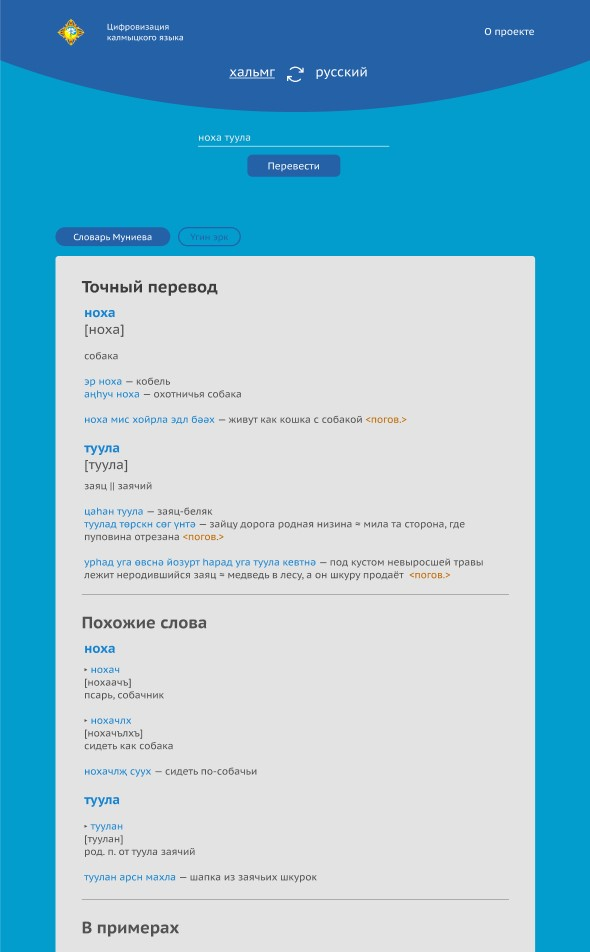

# Калмыцко-русский и русско-калмыцкий словарь

> Онлайн-словарь для широкого использования

## Описание

- Проект создан в образовательных целях по заказу Калмыцкого Государственного Университета им Б.Б.Городовикова

  

## Функциональность

- Выбор направления перевода: калмыцкий-русский или русский-калмыцкий языки
- Перевод по запросу до 3-х слов одновременно
- Поиск словарных статей по нескольким словарям
- Поиск с точным совпадением
- Поиск с частичным совпадением
- Примеры использования

## Установка

Чтобы запустить проект локально, используйте npm (CLI Node.js):

```
$ npm install
$ npm start
```

## Производственная сборка

Для финальной сборки проекта используйте npm (CLI Node.js):

```
$ npm run build
```
