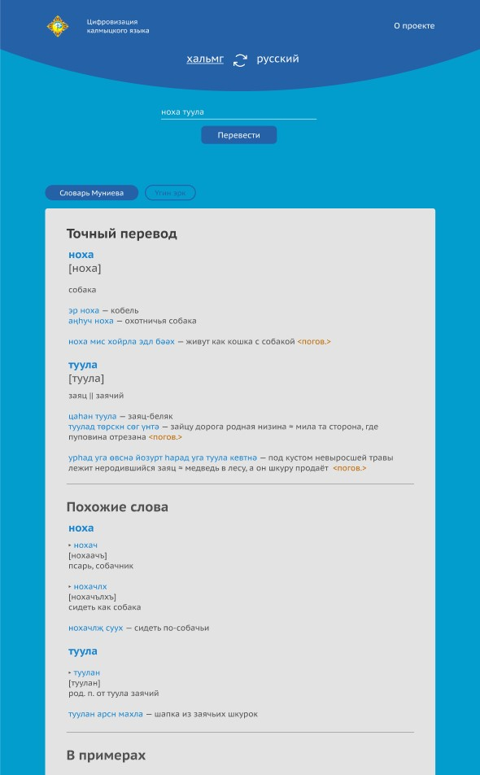

# Калмыцко-русский и русско-калмыцкий словарь

> Калмыцко-русский и русско-калмыцкий сводный электронный словарь.

## Описание

- Проект создан в образовательных целях по заказу Калмыцкого Государственного Университета им Б.Б.Городовикова



## Функциональность

- Выбор направления перевода: калмыцкий-русский или русский-калмыцкий языки
- Перевод по запросу до 3-х слов одновременно
- Поиск словарных статей по нескольким словарям
- Поиск с точным совпадением
- Поиск с частичным совпадением
- Поиск в примерах использования слов

## Описание технической реализации проекта

Для запуска приложений проекта необходима любая операционная система с установленным ПО для контейнеризации docker версии не ниже 20.10.21 и docker compose не ниже 2.12.2.

ПО представляет собой 4 докер-контейнера:
postgres - база данных postgres версии 14.5 с поддержкой стеммера калмыцкого языка.
backend - приложение на python 3.9, использующее FastAPI.
frontend - приложение на react, реализующее интерфейсную часть.
proxy - сервер nginx для проксирования запросов из внешней среды и внутри системы.

## Установка

Чтобы запустить проект локально, используйте npm (CLI Node.js):

```
$ cd ../dics-xal
$ npm install
$ npm start
```

## Производственная сборка

Для финальной сборки проекта используйте npm (CLI Node.js):

```
$ npm run build
```
